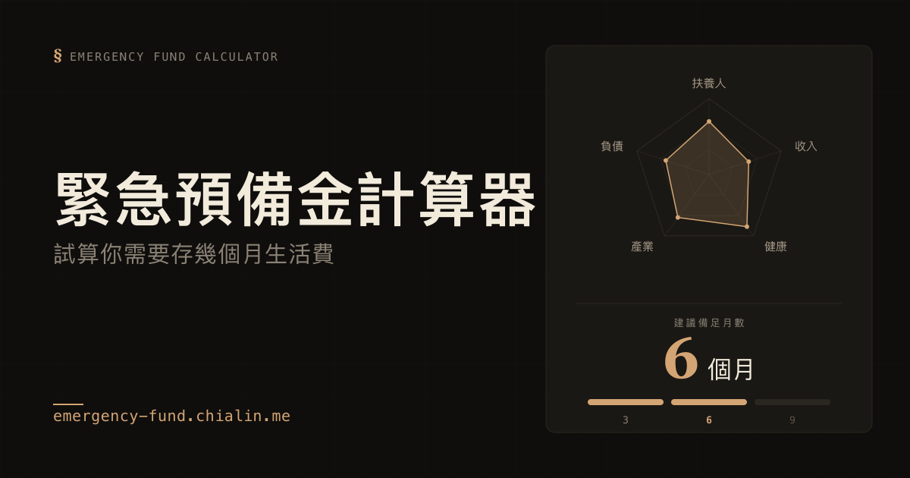

# Emergency Fund Reserve Calculator



🌐 **Live demo:** [emergency fund calculator](https://emergency-fund.chialin.me)

[English](#english) · [繁體中文](#繁體中文)

---

## English

A personalized emergency fund calculator based on CFPB guidelines, BLS unemployment data, and the 4% safe withdrawal rule.

### Features

- Manual input across 7 essential expense categories
- 5-dimension risk coefficients: income stability, dependents, industry volatility, expat / job-change exposure, health risk
- Multi-currency support: TWD / USD
- Defaults aligned with Taiwan DGBAS national average per-capita monthly consumption (~NT$23,500); single-person northern Taiwan baseline ~NT$26,700

### Default Expenses Reference

Defaults are calibrated to "single-person northern Taiwan, essentials only". Sources:

- [Taiwan DGBAS · Family Income & Expenditure Survey](https://www.stat.gov.tw/cl.aspx?n=2693) — national per-capita monthly consumption ~NT$23,500
- [Yahoo News · City-level per-capita spending](https://tw.news.yahoo.com/%E5%A4%A9%E9%BE%8D%E5%9C%8B%E7%94%9F%E6%B4%BB%E8%B2%BB%E5%A5%BD%E8%B2%B4-%E5%8F%B0%E5%8C%97%E5%B8%82%E4%BA%BA%E5%9D%87%E6%9C%88%E6%B6%88%E8%B2%BB3%E8%90%AC3730%E5%85%83%E5%B1%85%E5%86%A0-121724188.html) — Taipei NT$33,730 / Nantou NT$18,650
- [Money Magazine](https://money.cmoney.tw/article/28218) — category breakdown
- [Business Next · Household structure analysis 2014–2024](https://www.bnext.com.tw/article/84783/taiwan-household-consumption-structure-2014-2024-analysis) — housing / medical / food account for ~57%

Scale up proportionally for two-person or family scenarios.

### Tech Stack

- Vite 5 + React 18 + TypeScript
- ESLint (flat config) + Prettier
- Cloudflare Pages deployment

### Local Development

```bash
npm install
npm run dev          # Dev mode (http://localhost:5173)
npm run typecheck    # TypeScript type check
npm run lint         # ESLint
npm run lint:fix     # Auto-fix lint issues
npm run format       # Prettier format
npm run build        # Output to dist/
npm run preview      # Preview build output
```

### Deployment

This site auto-deploys via [Cloudflare Pages](https://pages.cloudflare.com/)' built-in GitHub integration — every push to `main` triggers a new production build automatically. **No GitHub Actions workflow is involved on the deploy side**; Cloudflare polls the repo directly.

**Pages project configuration** (Cloudflare Dashboard → Workers & Pages → `emergency-fund-calculator` → Settings → Builds & deployments):

| Setting                | Value            |
| ---------------------- | ---------------- |
| Production branch      | `main`           |
| Framework preset       | Vite             |
| Build command          | `npm run build`  |
| Build output directory | `dist`           |
| Environment variables  | `NODE_VERSION=20` |

**Custom domain**: `emergency-fund.chialin.me` is mapped via a CNAME record on the `chialin.me` zone (which lives on external DNS, not Cloudflare). The CNAME points at the project's `*.pages.dev` address; Cloudflare Pages issues the SSL cert via Universal SSL. Cloudflare Workers Custom Domains is not used because it requires the apex zone to be on Cloudflare DNS.

#### Replicating this setup on a fork

1. Push your fork to GitHub
2. Cloudflare Dashboard → Workers & Pages → Create → Pages → Connect to Git
3. Select your repo and apply the configuration table above
4. (Optional) Pages → Custom domains → add your own subdomain CNAME

#### Manual deploy from local

For one-off deploys that bypass git (e.g. quick hotfix preview):

```bash
npx wrangler login
npm run deploy   # = npm run build && wrangler pages deploy dist
```

### Project Structure

```
src/
├── App.tsx                          # Main app composition
├── main.tsx                         # React entry
├── types.ts                         # Shared TypeScript types
├── components/
│   ├── Header.tsx
│   ├── Footer.tsx
│   ├── SectionTitle.tsx
│   ├── Chip.tsx
│   ├── InputSourceSection.tsx       # 01 Expense input
│   ├── RiskProfileSection.tsx       # 02 Risk coefficients
│   └── CalculationResultSection.tsx # 03 Calculation result
├── lib/
│   ├── format.ts                    # Money / percent formatting
│   ├── i18n.ts                      # ZH / EN translations
│   └── risk.ts                      # Risk coefficient compounding
└── styles/
    ├── global.css
    └── theme.ts                     # Color tokens
```

### Methodology

- **3-6-9 rule**: based on US BLS unemployment duration statistics (median 11.1 weeks)
- **Essential vs discretionary spending**: per CFPB guidelines — only includes expenses that can't be cut during unemployment
- **Risk coefficient weighting**: starts from a 3-month base, additively scales by individual factors, capped at 18 months

See the SOURCES section in the `Footer` for full citations.

### License

Private. Personal finance tooling, not a substitute for professional advice.

---

## 繁體中文

基於 CFPB 指引、BLS 失業統計與 4% 安全提領法則的個人化緊急預備金計算器。

### 功能特色

- 手動填寫七大類必要支出
- 五維風險係數：收入穩定度、扶養人、產業特性、跨國 / 換工作期、健康風險
- 多幣別支援：TWD / USD
- 預設值對齊主計總處全台人均月消費（約 NT$23,500），北部單人 baseline 約 NT$26,700

### 預設支出來源

預設值以「北部單人都會、僅必要支出」為基準。資料來源：

- [行政院主計總處 · 家庭收支調查](https://www.stat.gov.tw/cl.aspx?n=2693) — 全台每人月消費平均約 NT$23,500
- [Yahoo News · 縣市人均月消費](https://tw.news.yahoo.com/%E5%A4%A9%E9%BE%8D%E5%9C%8B%E7%94%9F%E6%B4%BB%E8%B2%BB%E5%A5%BD%E8%B2%B4-%E5%8F%B0%E5%8C%97%E5%B8%82%E4%BA%BA%E5%9D%87%E6%9C%88%E6%B6%88%E8%B2%BB3%E8%90%AC3730%E5%85%83%E5%B1%85%E5%86%A0-121724188.html) — 台北 NT$33,730 / 南投 NT$18,650
- [Money 錢雜誌](https://money.cmoney.tw/article/28218) — 類別細項拆解
- [數位時代 · 家庭結構分析 2014–2024](https://www.bnext.com.tw/article/84783/taiwan-household-consumption-structure-2014-2024-analysis) — 住宅 / 醫療 / 食品三大項佔比約 57%

兩人或家庭情境請依比例上調。

### 技術棧

- Vite 5 + React 18 + TypeScript
- ESLint (flat config) + Prettier
- Cloudflare Pages 部署

### 本地開發

```bash
npm install
npm run dev          # 開發模式 (http://localhost:5173)
npm run typecheck    # TypeScript 型別檢查
npm run lint         # ESLint 檢查
npm run lint:fix     # 自動修復可修復的問題
npm run format       # Prettier 格式化
npm run build        # 產出 dist/
npm run preview      # 預覽 build 結果
```

### 部署

此站台透過 [Cloudflare Pages](https://pages.cloudflare.com/) 內建的 GitHub 整合自動部署 —— 每次 push 到 `main` 分支會觸發新的 production build，**部署端不經過任何 GitHub Actions workflow**，由 Cloudflare 直接 poll repo。

**Pages 專案設定**（Cloudflare Dashboard → Workers & Pages → `emergency-fund-calculator` → Settings → Builds & deployments）：

| 設定項目               | 值                |
| ---------------------- | ----------------- |
| Production branch      | `main`            |
| Framework preset       | Vite              |
| Build command          | `npm run build`   |
| Build output directory | `dist`            |
| Environment variables  | `NODE_VERSION=20` |

**自訂網域**：`emergency-fund.chialin.me` 是在 `chialin.me` zone（DNS 託管於 Cloudflare 之外）建立 CNAME 指向 Pages 的 `*.pages.dev` 位址，SSL 憑證由 Cloudflare Pages 透過 Universal SSL 自動簽發。沒有改用 Cloudflare Workers Custom Domains 是因為它需要 apex zone 託管在 Cloudflare DNS。

#### Fork 後複製這套設定

1. 把 fork push 到自己的 GitHub
2. Cloudflare Dashboard → Workers & Pages → Create → Pages → Connect to Git
3. 選擇你的 repo，套用上方設定表
4. （選用）Pages → Custom domains 加自己的子網域 CNAME

#### 從本地手動部署

繞過 git 的一次性部署（例如 hotfix 前先看效果）：

```bash
npx wrangler login
npm run deploy   # = npm run build && wrangler pages deploy dist
```

### 專案結構

```
src/
├── App.tsx                          # 主應用，組合各區塊
├── main.tsx                         # React 入口
├── types.ts                         # 共用 TypeScript 型別
├── components/
│   ├── Header.tsx
│   ├── Footer.tsx
│   ├── SectionTitle.tsx
│   ├── Chip.tsx
│   ├── InputSourceSection.tsx       # 01 支出輸入
│   ├── RiskProfileSection.tsx       # 02 風險係數
│   └── CalculationResultSection.tsx # 03 計算結果
├── lib/
│   ├── format.ts                    # 金額/百分比格式化
│   ├── i18n.ts                      # 中英文翻譯字典
│   └── risk.ts                      # 風險係數加成計算
└── styles/
    ├── global.css
    └── theme.ts                     # 配色 token
```

### 方法論

- **3-6-9 法則**：基於美國 BLS 失業期統計（中位 11.1 週）
- **必要支出 vs 可裁切支出**：依 CFPB 指引，僅計入失業期間無法削減的開支
- **風險係數加權**：從基底 3 個月開始，依個人情境累加，上限 18 個月

詳見 `Footer` 區塊的 SOURCES。

### License

Private. 個人理財工具，不構成專業建議。
